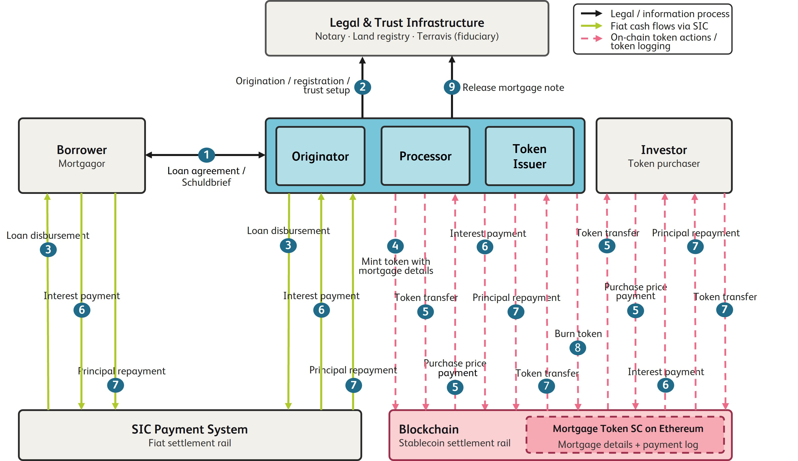

# Mortgage Token
This repository contains a mortgage token prototype implementation as a part of the IFZ Crypto Assets Study 2026 (TBA). 


## Architecture
Each mortgage is represented on-chain as a single ERC-721 token (`MortgageToken`, symbol `MORT`), minted by
the issuer and later transferred to the investor who funds it. The current ERC-721 owner of the token is always the tokenholder of record for that mortgage, and stablecoin cashflows (purchase price, interest, principal redemption) move between issuer and tokenholder alongside the corresponding fiat legs, which are settled off-chain via SIC and recorded on-chain by reference. A mortgage moves through four lifecycle stages: `Created → Active → Redeemed → Closed`, driven by the functions below.



The figure above shows the simplified process sequence:
1. Loan agreement and mortgage note;
2. origination, registration, and trust setup;
3. loan disbursement through SIC;
4. minting of the mortgage token;
5. stablecoin purchase-price settlement and token transfer;
6. fiat interest payment through SIC and corresponding stablecoin payment through the smart contract;
7. fiat principal repayment through SIC and corresponding stablecoin redemption payment through the smart contract;
8. token burning; and
9. release of the mortgage note.

Scope assumptions:
- The mortgage is interest-only; the full principal is repaid at maturity.
- The token is transferred to the investor before the first interest payment becomes due.
- The terms and parties of the loan agreement and mortgage deed remain unchanged during the token's lifetime.
- The mortgage note is held by Terravis in a fiduciary capacity and released after full repayment.
- Payment defaults, insolvency, enforcement proceedings, stablecoin de-pegging, blockchain settlement failures, and operational
  fiat–stablecoin conversion are not considered.


## Tech stack

- **Smart contracts**: Solidity `^0.8.24`, built on [OpenZeppelin Contracts](lib/openzeppelin-contracts) (`ERC721`,
  `Ownable`, `IERC20`/`SafeERC20`). `MortgageToken.sol` is the core ERC-721 contract; `MockStablecoin.sol` is a
  mintable ERC-20 test stablecoin used for local/testnet demos.
- **Development & deployment**: [Foundry](https://book.getfoundry.sh/) (`forge`, `anvil`, `cast`) — see
  `foundry.toml` and `script/MortgageToken.s.sol` for the deployment script.
- **Frontend**: Python + [Streamlit](https://streamlit.io) (`frontend/app.py`) as the demo UI, talking to the
  chain via [web3.py](https://web3py.readthedocs.io) (see `frontend/requirements.txt`).
- **Networks**: local [Anvil](https://book.getfoundry.sh/anvil/) chain for development, Ethereum **Sepolia**
  testnet for a closer-to-real demo (using Circle's testnet USDC).
- **Wallets**: [MetaMask](https://metamask.io) is used for the investor’s ERC-20 approve transactions. For prototype purposes, issuer transactions are signed directly in the frontend using a supplied private key.

## Contract functions (`src/MortgageToken.sol`)

State-changing (all `onlyOwner`, i.e. callable only by the issuer account that owns the contract):

- **`createMortgage`** — Mints a new mortgage token to the issuer. Requires off-chain legal setup
  (loan agreement, land registry filing) and loan disbursement to already be confirmed. Moves the mortgage
  into `Created` status.
- **`transferTokenToInvestor`** — Records the investor, pulls the stablecoin purchase price from the
  investor (who must have pre-approved the contract) and forwards it to the issuer, then transfers the
  token to the investor. Moves the mortgage into `Active` status.
- **`payInterest`** — Records a fiat interest payment received via SIC and pulls the matching stablecoin
  interest payment from the issuer, forwarding it to the current tokenholder.
- **`updatePaymentReference`** — Fills in a payment record's stablecoin transaction reference after the
  fact (needed because a transaction's own hash isn't known until after it's sent).
- **`redeemToken`** — At maturity, confirms the fiat principal repayment via SIC and pulls the matching
  stablecoin principal redemption from the issuer, forwarding it to the current tokenholder, then transfers
  the token back to the issuer. Moves the mortgage into `Redeemed` status.
- **`burnToken`** — Burns the token after redemption and moves the mortgage into `Closed` status.

Read-only:

- **`getMortgage`** — Returns the full stored `Mortgage` struct for a given mortgage ID.
- **`getPaymentRecords`** — Returns the list of recorded payments (purchase price, interest, principal
  redemption) for a mortgage.
- **`getDocumentHashes`** — Returns the document hashes attached to a mortgage at creation.
- **`currentTokenholder`** — Returns the current ERC-721 owner (tokenholder) of a mortgage.

# How to run the prototype

## Local blockchain (Anvil)

Prerequisites:

- [Foundry](https://book.getfoundry.sh/getting-started/installation) installed (provides `forge`, `anvil`, `cast`).
- Python 3 and `pip` installed, for running the Streamlit frontend.

Step 1: Start local chain in one terminal
   ```
   anvil
   ```

Step 2: Deploy the contract
   ```
   forge script script/MortgageToken.s.sol --rpc-url http://127.0.0.1:8545 --private-key <YOUR_PRIVATE_KEY> --broadcast
   ```
   Note the deployed contract address printed in the logs.

Step 3: Run the app
   ```
   pip install -r frontend/requirements.txt
   streamlit run frontend/app.py
   ```
   In the sidebar: paste the RPC url, contract address, and the owner private key used to deploy.

Step 4: Mint test stablecoins to any accounts that need them to execute functions, using `cast send` (works
   against `MockStablecoin`, which has an open `mint()`)
   ```
   cast send <MOCK_STABLECOIN_ADDRESS> "mint(address,uint256)" <RECIPIENT_ADDRESS> <AMOUNT_IN_UNITS> \
     --rpc-url http://127.0.0.1:8545 --private-key <ANY_PRIVATE_KEY>
   ```

## Testnet (e.g. Sepolia)

Prerequisites:

- Before starting the app, set up two separate MetaMask accounts: one for the **issuer** and one for the
**investor**. Both accounts need to be topped up with:

  - **Sepolia test ETH** (for gas) — faucet: https://cloud.google.com/application/web3/faucet/ethereum/sepolia
  - **Sepolia test USDC** (for payments) — faucet: https://faucet.circle.com

Step 1: Deploy the contract
   ```
   forge script script/MortgageToken.s.sol --rpc-url https://ethereum-sepolia-rpc.publicnode.com --private-key <YOUR_PRIVATE_KEY> --broadcast
   ```
   Note the deployed `MortgageToken` address printed in the logs. `

Step 2: Run the app and point the sidebar at `<SEPOLIA_RPC_URL>` and the deployed contract address

   Sepolia RPC URL: https://ethereum-sepolia-rpc.publicnode.com

Step 3: Use USDC testnet contract as a stablecoin smart contract

   USDC testnet contract: 0x1c7D4B196Cb0C7B01d743Fbc6116a902379C7238


## Investor approval via MetaMask (Transfer to Investor step)

The investor must approve the `MortgageToken` contract to pull the purchase price from their own wallet
before the issuer can settle the transfer. A real investor won't hand their private key to the app, so
this step is done from the investor's own MetaMask, outside the app.

1. In the app's **Transfer to Investor** tab, enter the mortgage ID, purchase price, and investor address.
   If the investor hasn't approved enough yet, the tab shows a warning box with the exact `spender` and
   `amount` values and the raw hex calldata for `approve()`.
2. In MetaMask: **Settings → Advanced → enable "Show Hex Data"** (adds a hex data field to the Send screen).
3. Switch to the **investor's account**, on the same network as the deployment (e.g. Sepolia).
4. Go to **Send** and fill in:
   - **Recipient**: the **stablecoin contract address** (e.g. `0x1c7D4B196Cb0C7B01d743Fbc6116a902379C7238`
     for Sepolia testnet USDC) — **not** the `MortgageToken` contract address. 
   - **Amount**: `0` (this transaction moves no ETH — the USDC amount is encoded in the hex data instead)
   - **Hex Data**: the calldata shown in the app's warning box
5. Confirm and sign from the investor's wallet.
6. Once mined, go back to the app and click **"Settle Purchase and Transfer"** — this step is signed by
   the issuer's own private key from the sidebar (no MetaMask needed here; a real bank would hold this key
   in its own backend, not click through a wallet UI by hand).


# Disclaimer

Any concepts, models, data, software elements, or recommendations included are provided solely for research, demonstration, or illustrative purposes. They are not intended for production use, system integration, or operational implementation and do not constitute any representation regarding regulatory compliance. Any use in operational or regulatory-relevant contexts is outside the scope of responsibility of the IFZ, HSLU.